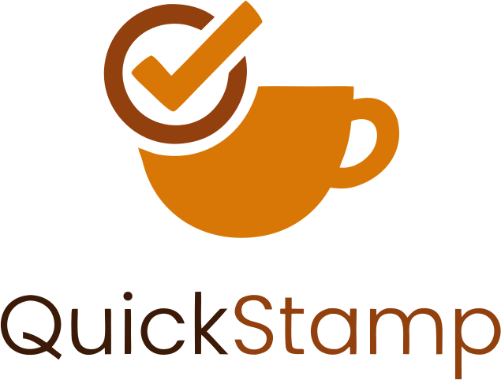

<div align="center">



# QuickStamp

**Drink. Stamp. Earn.** — A self-hosted, multi-tenant loyalty platform for coffee shops.

Staff generate short-lived QR codes at the counter; customers scan them to collect points and redeem free drinks.

🌐 **Live demo:** [quickstamp.com.tr](https://quickstamp.com.tr)

[](https://github.com/claymorenjoyer/quickstamp/actions/workflows/ci.yml)

</div>

---

## Requirements

- [Docker](https://docs.docker.com/get-docker/) with Compose — that's all for running the app
- [Node.js](https://nodejs.org) ≥ 20.9 — only for local development

## Features

- ☕ **Multi-tenant** — any number of coffee shops on a single deployment, each with its own staff, customers, and point balances
- ⏱️ **Short-lived QR codes** — staff generate time-limited codes, so points can only be earned at the counter
- 🎁 **Verified redemptions** — customers redeem points for a free drink; staff confirm the redemption by scanning the customer's QR
- 👥 **Three roles** — customer, staff, and admin (new shop registrations require admin approval)
- 🔐 **Self-contained auth** — Auth.js v5 credentials login with JWT sessions, bcrypt password hashing, password-reset flow, and per-IP login rate limiting — no third-party auth provider
- 🌍 **Bilingual** — Turkish and English UI (Turkish default)
- 📱 **Installable PWA** — mobile-first design, add-to-home-screen support
- 📊 **Staff analytics** — stamp and redemption history per shop
- 🐳 **One-command deploy** — Docker Compose with PostgreSQL, health-checked startup, standalone Next.js output

## Tech Stack

| Layer     | Technology                                        |
| --------- | ------------------------------------------------- |
| Framework | Next.js 16 (App Router) · React 19 · TypeScript   |
| Database  | PostgreSQL 16 (`pg`, hand-written SQL, no ORM)    |
| Auth      | Auth.js v5 (JWT credentials) · bcrypt             |
| UI        | Tailwind CSS 4 · html5-qrcode                     |
| Infra     | Docker · Docker Compose                           |

## Quick Start

```bash
cp .env.sample .env      # edit with secure values
docker compose up -d     # PostgreSQL + app on http://localhost:3000
```

Default admin account: `admin@quickstamp.local` / `admin123` — **change this after first login.**

Optional pgAdmin console:

```bash
docker compose --profile tools up -d   # pgAdmin on :5050
```

## Development

```bash
cp .env.sample .env      # if you haven't already
docker compose up -d db  # start PostgreSQL only
npm install
npm run dev              # dev server on http://localhost:3000
```

The dev server connects to the database via `DATABASE_URL` in `.env` — if you
change any `DB_*` value, update `DATABASE_URL` to match.

> **Testing the camera on a phone?** Browsers only expose the camera over HTTPS.
> Generate local certs (e.g. with [mkcert](https://github.com/FiloSottile/mkcert)) into `certs/`
> and run `npm run dev:https`.

## How It Works

1. A shop registers and is approved by the platform admin.
2. Staff open the shop dashboard and generate a QR code — each code is valid for a short window.
3. The customer scans the code with their phone and a point is added to their balance at that shop.
4. When enough points accumulate, the customer taps **Redeem** — this produces a redemption QR.
5. Staff scan the redemption QR to confirm the free drink, closing the loop.

## Database Schema

Five tables, multi-tenant by `shop_id`:

- `shops` — registered coffee shops (with approval status)
- `users` — customers, staff, and admins (role-based)
- `qr_codes` — short-lived stamp tokens issued by staff
- `points` — point ledger per customer per shop
- `rewards` — redemptions with verification tokens

Schema is initialized automatically from [`sql/init.sql`](sql/init.sql) on first startup.

## Project Structure

```
src/
├── app/
│   ├── api/            # REST endpoints (auth, admin, staff, customer, rewards)
│   ├── admin/          # admin dashboard (shop approvals, user management)
│   ├── staff/          # staff dashboard (QR generation, scanning, analytics)
│   ├── dashboard/      # customer dashboard (points, shops, scanning)
│   └── ...             # login, register, password reset, settings
├── components/         # shared UI components
├── lib/                # db pool, auth config, i18n, rate limiter
└── middleware.ts       # route protection by role
```

## Security Notes

- Passwords hashed with bcrypt; sessions are signed JWTs (`AUTH_SECRET`)
- Login endpoint rate-limited per IP (5 attempts / 15 min)
- Stamp QR tokens expire after a short window and are validated server-side
- Runs as a non-root user inside the Docker image

## License

[MIT](LICENSE)
